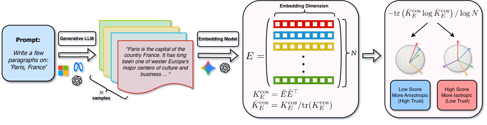

# Embedding Trust: Semantic Isotropy Predicts Nonfactuality in Long‑Form Text Generation




[](https://arxiv.org/abs/2510.21891)

This repository contains end-to-end instructions and pipelines to reproduce and generate the empricial evaluation presented in the paper:

**_Embedding Trust: Semantic Isotropy Predicts Nonfactuality in Long‑Form Text Generation._** Dhrupad Bhardwaj, Julia Kempe, Tim G.J. Rudner.

---

## 🧠 Overview

The project introduces **Semantic Isotropy**, a lightweight, model‑agnostic measure that quantifies the *dispersion* of normalized text embeddings across multiple LLM generations. High isotropy (uniform dispersion on the unit sphere) correlates strongly with **nonfactuality**, while low isotropy (tight clustering) signals **trustworthy, factually consistent** generations.

Unlike claim‑by‑claim fact‑checking methods, Semantic Isotropy requires:

- No labeled data or fine‑tuning
- No hyperparameter tuning
- Only a few generated samples per prompt

It provides a computationally inexpensive proxy for factual consistency in long‑form text generation.

---

## Abstract

> To deploy large language models (LLMs) in high-stakes application domains that require substantively accurate responses to open-ended prompts, we need reliable, computationally inexpensive methods that assess the trustworthiness of long-form responses generated by LLMs. However, existing approaches often rely on claim-by-claim fact-checking, which is computationally expensive and brittle in long-form responses to open-ended prompts. In this work, we introduce semantic isotropy—the degree of uniformity across normalized text embeddings on the unit sphere—and use it to assess the trustworthiness of long-form responses generated by LLMs. To do so, we generate several long-form responses, embed them, and estimate the level of semantic isotropy of these responses as the angular dispersion of the embeddings on the unit sphere. We find that higher semantic isotropy—that is, greater embedding dispersion—reliably signals lower factual consistency across samples. Our approach requires no labeled data, no fine-tuning, and no hyperparameter selection, and can be used with open- or closed-weight embedding models. Across multiple domains, our method consistently outperforms existing approaches in predicting nonfactuality in long-form responses using only a handful of samples—offering a practical, low-cost approach for integrating trust assessment into real-world LLM workflows.

---
## 📂 Repository Structure

```
├── lib/python/semantic_isotropy/          # Core implementation libraries
│              ├── datasets          # Data loading and manipulation
│              ├── llm               # LLM APIs for queries and embeddings
│              ├── metrics           # Uncertainty Metrics
│              ├── pipeline          # Pipeline utilities for experiment generation
│              ├── prompts           # Prompt Library
│              └── tests             # Unit tests for pipeline utilities
│
├── notebooks/               # Example Jupyter notebooks
│   └── quickstart.ipynb
│
├── scripts/               # Driver Scripts
│   ├── oeq
│       ├── oeq_sample.py
│       ├── factscore_open_ended_gen.py
│       └── triviaqa_open_ended_gen.py
│   ├── segscore
│       ├── oeq_seg_score.py
│       └── gen_metric.py
│   └── runner.py
│
├── data/
│   └── bio_entities.txt     # List of entities for FS-BIO Dataset
│
├── assets/                 # Plots and visualizations from the paper
│
├── requirements.txt
├── README.md
└── LICENSE
```
---

## Installation

```bash
# Clone repository
git clone https://github.com/dhrupadb/semantic_isotropy.git
cd semantic_isotropy

# Create environment
python -m venv /path/to/venvs/semantic_isotropy
source /path/to/venvs/semantic_isotropy/bin/activate

# Install dependencies
pip install -r requirements.txt

# Install Local Libraries
pip install -e .
```
---

## 🚀 Quick Start

See `notebooks/quickstart.ipynb` to view examples of generating and scoring long form text using **Semantic Isotropy** as well as using the **SegmentScore** dataset.

---
## 📚 Datasets

The **SegmentScore** can be found on HuggingFace! [dhrupad/SegmentScore](https://huggingface.co/datasets/dhrupadb/SegmentScore)

---

## 🔁 Reproducing Paper Results

To reproduce the main results:

### 1. Generate Set of Prompt Entities
```
python scripts/oeq/triviaqa_open_ended_gen.py --output_dir ~/datasets/experiments/triviaqa/
```

### 2. Generate Samples for prompts

```
python scripts/oeq/oeq_sample.py --model microsoft/Phi-3.5-mini-instruct --input-path ~/datasets/experiments/triviaqa/triviaqa_oe_prompts.csv --n 20 --batch-size 120 --dtype half
        --output-path ~/datasets/experiments/triviaqa/oeq_sample_msft_phi3.5-mini-instruct/responses.jsonl --tensor_parallel_size 4 --temperature 0.7 --group-batch-size 120 --word-count 500
```

Assumes 4 GPU node. Set `tensor_parallel_size` accordingly.

### 3. Segment and Score responses
```
python scripts/segscore/oeq_seg_score.py --input-path ~/datasets/experiments/triviaqa/oeq_sample_msft_phi3.5-mini-instruct/responses.jsonl
    --output-path ~/datasets/experiments/triviaqa/oeq_sample_msft_phi3.5-mini-instruct/seg_score.jsonl --group-batch-size 50 --model gpt-4.1-mini --dataset triviaqa
```

### 4. Generate Metrics on Segmented Dataset (using API model to score)
```
python scripts/segscore/gen_metric.py --input-path ~/datasets/experiments/triviaqa/oeq_sample_msft_phi3.5-mini-instruct/seg_score.jsonl --output-path ~/datasets/experiments/triviaqa/oeq_sample_msft_phi3.5-mini-instruct/si_gemini.pkl
```

### 5. Generate Metrics on Segmented Dataset (using Open Weight Model)
```
python scripts/segscore/gen_metric.py --input-path ~/datasets/experiments/triviaqa/oeq_sample_msft_phi3.5-mini-instruct/seg_score.jsonl --output-path ~/datasets/experiments/triviaqa/oeq_sample_msft_phi3.5-mini-instruct/si_deberta.pkl
```

### 6. Running embedding pipelines using Job Runner Utility [OPTIONAL]
See the template `config/sample.cfg` file to generate a configuration of scoring tasks. These can be run in a parallelized fashion using the command below:
```
python scripts/runner -c config/sample.cfg [-d,--dryrun,-q]
```

All sampling and experiments can be run on a single node with 4 x NVIDIA V100 GPUs or equivalent.

---
## 🧩 Citation

```bibtex
@misc{bhardwaj2025embeddingtrustsemanticisotropy,
      title={Embedding Trust: Semantic Isotropy Predicts Nonfactuality in Long-Form Text Generation},
      author={Dhrupad Bhardwaj and Julia Kempe and Tim G. J. Rudner},
      year={2025},
      eprint={2510.21891},
      archivePrefix={arXiv},
      primaryClass={cs.CL},
      url={https://arxiv.org/abs/2510.21891},
}
```
---

## Contact
Please contact [Dhrupad Bhardwaj](mailto:db4045*AT*nyu*DOT*edu) or [Tim G.J. Rudner](mailto:tim*AT*timrudner*DOT*com) for any queries.
We welcome any suggestions or contributions!

